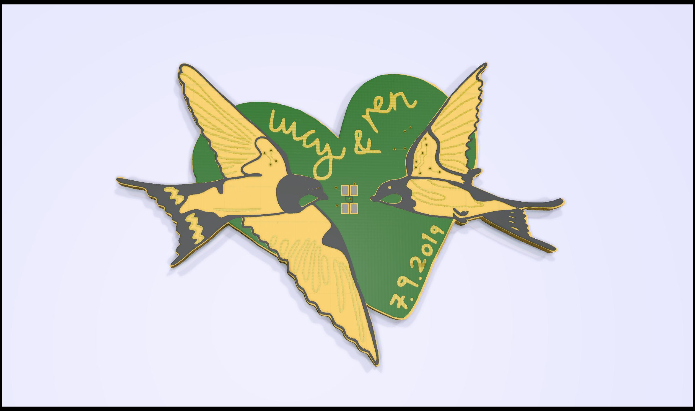

# design

1300 dpi to convert from Rachel file to 71x51mm badge
$63 for 100 from pcbway

* mask - normal then edit file to change layer
* silk - invert
* copper - invert then edit file
* outline - fill black, export png, import inkscape, path->trace outline, scale 5.66, export DXF

reduced size of master image by 4 to 1008x756

## feedback

* had to tell pcbway to keep silkscreen on copper with no mask (otherwise would normally be a design error and they remove it)
* should have used mask on silk areas anyway, as it doesn't stick well onto plain copper
* should have removed mask on the back that matches with removed mask on the front as the mask on the back makes the FR4 look green

# BOM

* pins - ordered from amazon
* slide switch - farnell
* battery - ordered amazon
* battery holder - farnell
* attiny - check footprint & parts I have - done is correct
* 0.1u x 1  - dnp 
* 1u x 1 - dnp
* 10k x 1 - farnell
* 47R x 1 - farnell

# firmware

* "bitbanged" pwm with interrupt on timer1
* needed to set BOD level lower in fuses for 3v battery
